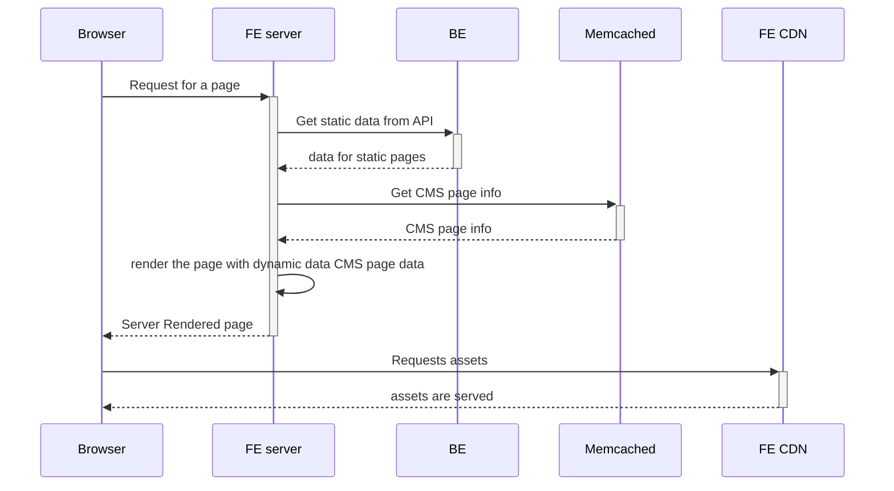
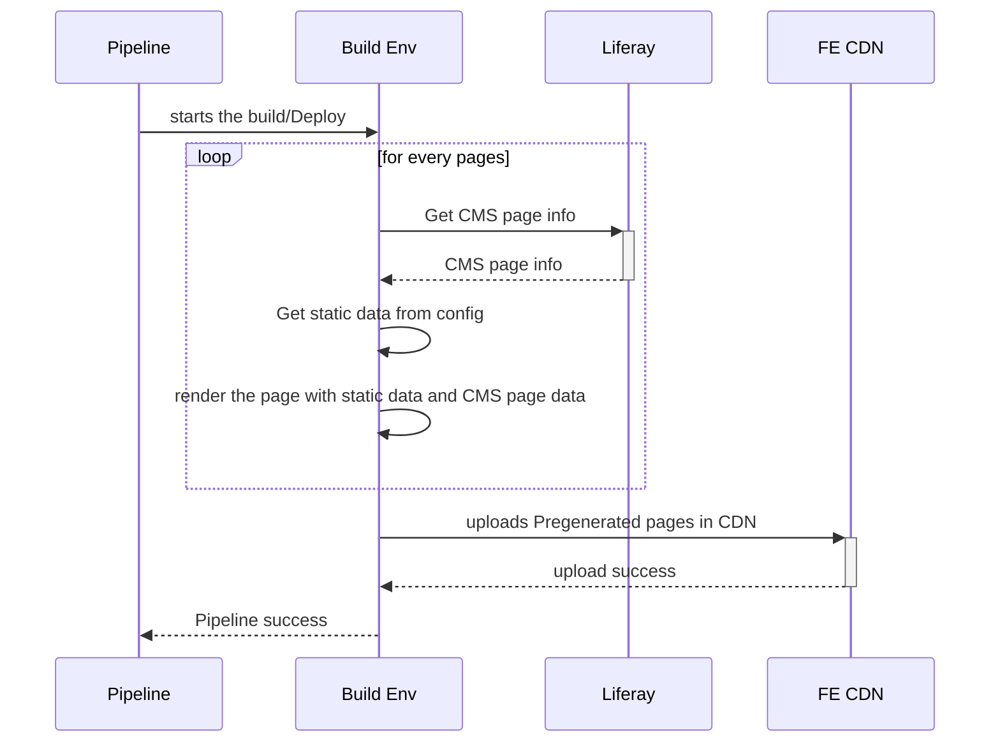
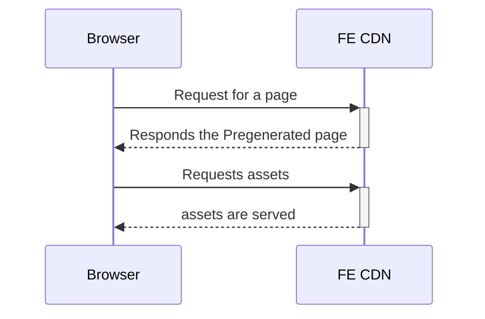

# User request flow

## Current FE

```mermaid
sequenceDiagram

Browser ->>+ FE server : Request for a page
FE server ->>+ BE : Get static data from API
BE -->>- FE server : data for static pages
FE server ->>+ Memcached : Get CMS page info
Memcached -->>- FE server : CMS page info
FE server ->> FE server : render the page with dynamic data CMS page data
FE server -->>- Browser : Server Rendered page
Browser ->>+ FE CDN : Requests assets
FE CDN -->>- Browser : assets are served 

```

## Target FE

**Build Flow**

```mermaid
sequenceDiagram

Pipeline ->> Build Env : starts the build/Deploy

loop for every pages
    Build Env ->>+ Liferay : Get CMS page info
    Liferay -->>- Build Env : CMS page info
    Build Env ->> Build Env : Get static data from config
    Build Env ->> Build Env : render the page with static data and CMS page data
end

Build Env ->>+ FE CDN : uploads Pregenerated pages in CDN
FE CDN -->>- Build Env : upload success
Build Env -->> Pipeline : Pipeline success
```

**User request Flow**

```mermaid
sequenceDiagram
Browser ->>+ FE CDN : Request for a page
FE CDN -->>- Browser : Responds the Pregenerated page
Browser ->>+ FE CDN : Requests assets
FE CDN -->>- Browser : assets are served 

```