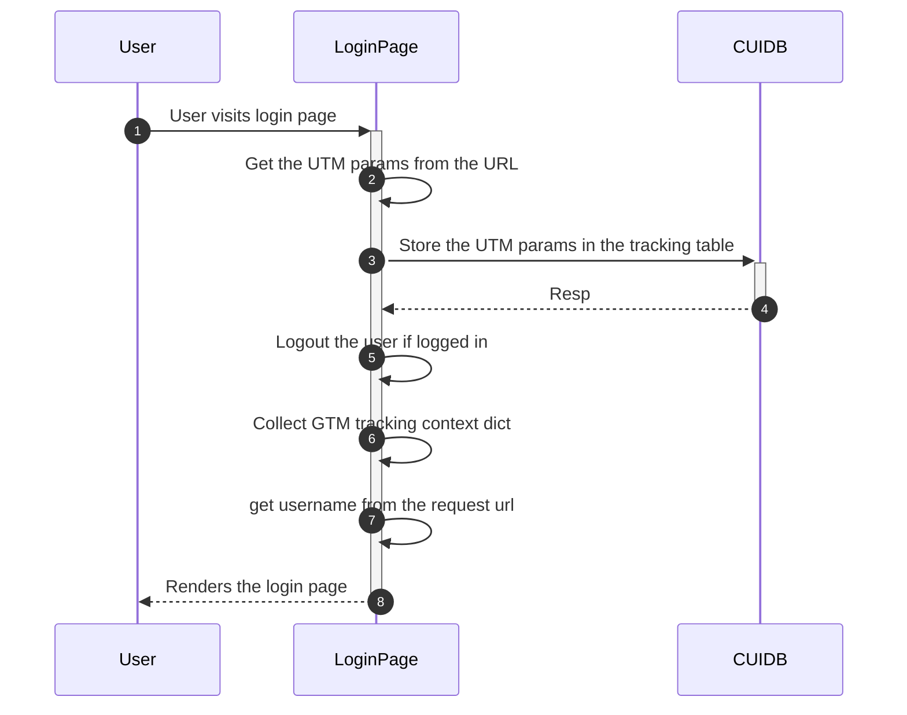

# Get flow of Drafty Login Page

```mermaid
sequenceDiagram
autonumber
User ->>+ LoginPage: User visits login page
LoginPage ->> LoginPage : Get the UTM params from the URL
LoginPage ->>+ CUIDB : Store the UTM params in the tracking table
CUIDB -->>- LoginPage : Resp
LoginPage ->> LoginPage : Logout the user if logged in
LoginPage ->> LoginPage : Collect GTM tracking context dict
LoginPage ->> LoginPage : get username from the request url

LoginPage -->>- User : Renders the login page
         
```