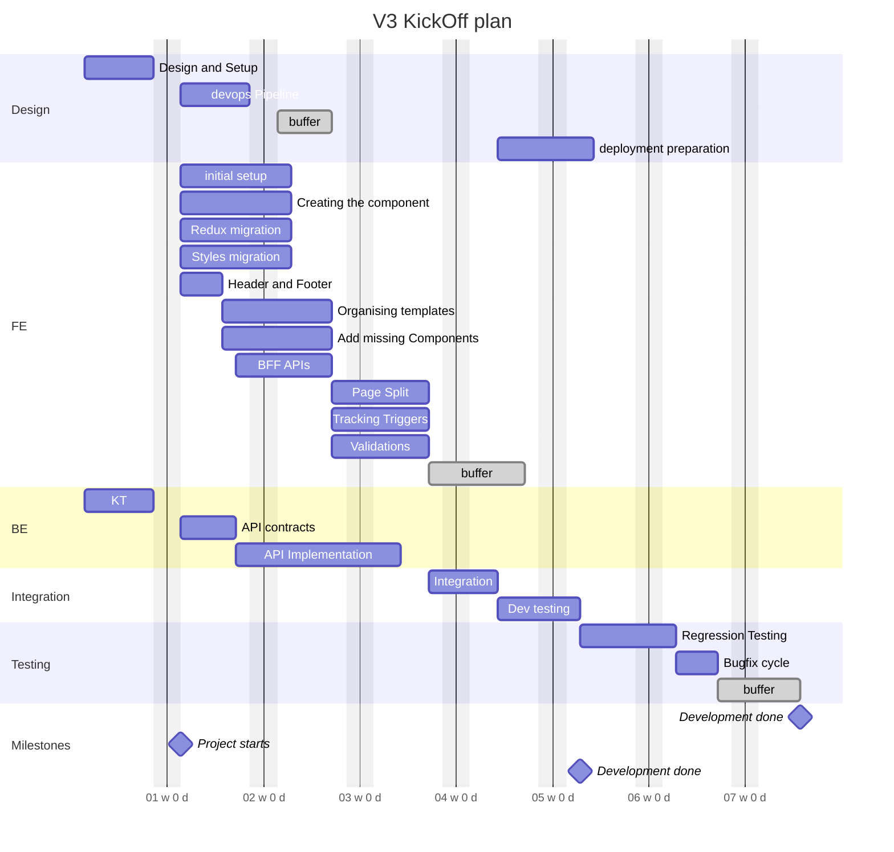

# Introduction

Documentation for V3 Architecture.[Beta]

## Plan for Drafty Apply one and two

```mermaid
gantt
    title V3 KickOff plan
    dateFormat YYYY-MM-DD
    axisFormat %W w %w d
    excludes    weekends

    section Design
    Design and Setup : ds, 2022-01-03, 5d
    devops Pipeline  : after ds, 5d
    buffer :done, 4d
    deployment preparation:dp, after id, 5d

    section FE
    initial setup: is, after ds, 6d
    Creating the component :cc, after ds, 6d
    Redux migration :rm, after ds, 6d
    Styles migration :sm, after ds, 6d
    Header and Footer :cc, after ds, 3d
    
    Organising templates   :ot, after cc, 6d
    Add missing Components :mc, after cc, 6d
    BFF APIs : bff, after ac, 5d
    Page Split: ps, after ot, 5d
    Tracking Triggers: tt, after ot, 5d
    Validations: v, after ot, 5d
    buffer:done, 5d
    
    section BE
    KT : kt, 2022-01-03, 5d
    API contracts : ac, after ds, 4d
    API Implementation: ai, after ac, 8d

    section Integration
    Integration: id, after ps, 3d
    Dev testing: dt,after id, 4d

    section Testing
    Regression Testing: after dt,5d
    Bugfix cycle: 3d
    buffer: done, 4d

    section Milestones
    Development done : milestone,m1    
    Project starts : milestone,m1, after ds, 2m
    Development done : milestone,m1, after dt, 2m

```

